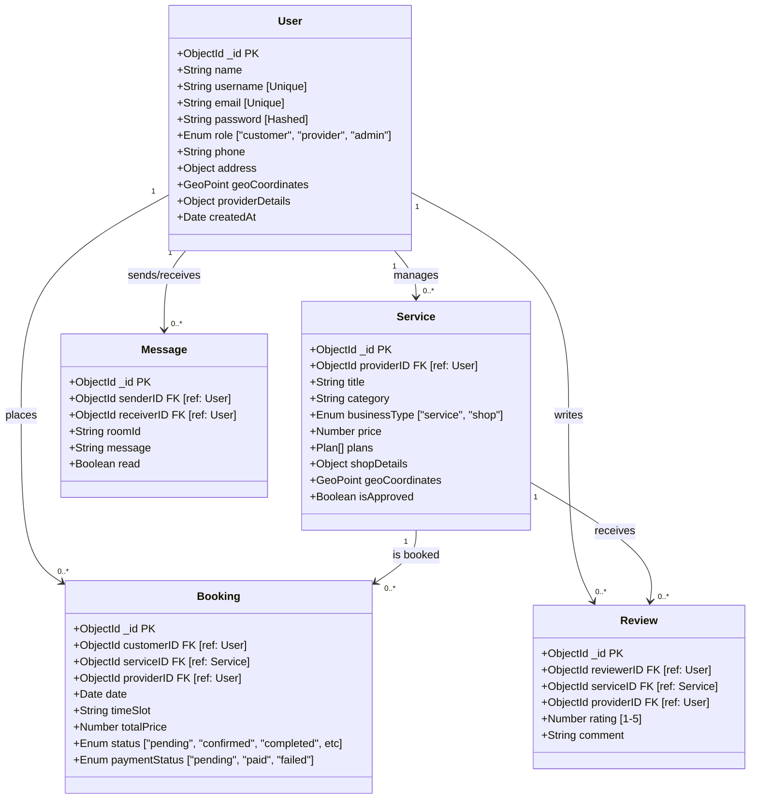

# SkillNear Database & Architecture Documentation

This document provides a comprehensive technical breakdown of the SkillNear data layer.

## 1. Relational Database Schema (Logical)

The following diagram uses a structured schema notation to show primary keys (PK), foreign keys (FK), and attribute data types. This is optimized for a physical database implementation in MongoDB.

## 2. Technical ER Diagram (Visual Schema)

*This visualization mimics a professional database design tool, showing the precise links between tables and attribute lists.*

## 3. Data Dictionary

### User Table (Collection: `users`)
| Field | Type | Description |
| :--- | :--- | :--- |
| `_id` | ObjectId | Primary Key |
| `role` | String | Defines permissions (admin access, provider dashboard visibility). |
| `geoCoordinates` | Object | Used for `$near` and `$geoWithin` queries (GeoJSON format). |

### Service Table (Collection: `services`)
| Field | Type | Description |
| :--- | :--- | :--- |
| `provider` | ObjectId | Reference to the `User` who owns this service. |
| `plans` | Array | Nested objects containing Basic, Standard, and Premium tiers. |
| `isApproved` | Boolean | Visibility flag controlled by admin moderation. |

### Booking Table (Collection: `bookings`)
| Field | Type | Description |
| :--- | :--- | :--- |
| `status` | String | Tracks the state machine: `pending` -> `confirmed` -> `completed`. |
| `paymentStatus` | String | Integrated with the checkout workflow. |

---

## 4. Connectivity & Cardinality
- **User to Service (1:N)**: A provider can host multiple services (e.g., a tutor offering Math and Science).
- **Service to Booking (1:N)**: A single service listing can have hundreds of historical and active bookings.
- **User to Booking (1:N)**: A customer registers multiple bookings across different service categories.
- **Message Room (N:M)**: Users are linked via unique `roomId` strings in the chat system.
